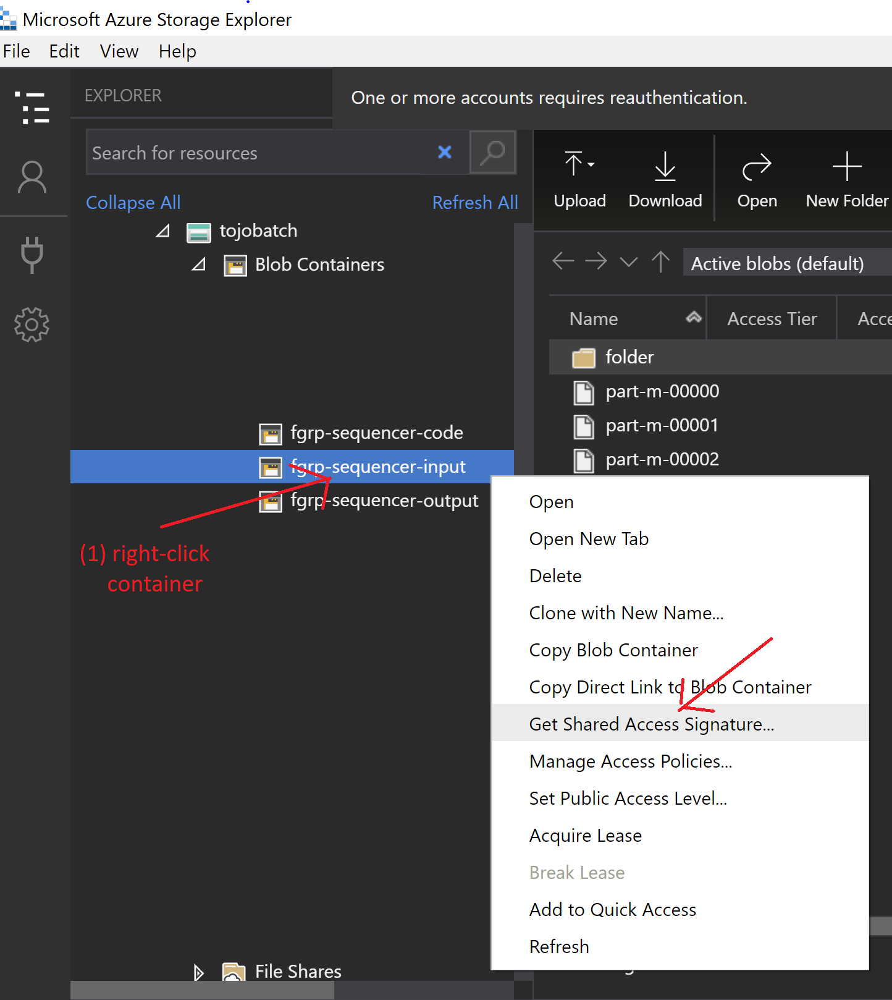

# Azure Batch HBASE to JSON converter
This repository offers Azure Batch templates to run parallel convertion jobs from HBASE sequence file to JSON format. 

## Prerequisites
1. Azure [subscription](https://azure.microsoft.com/en-us/) 
2. Azure [Batch account](https://azure.microsoft.com/en-us/services/batch/) and a linked [blob storage](https://azure.microsoft.com/en-us/services/storage/blobs/) account.  
 See [here](https://docs.microsoft.com/en-us/azure/batch/batch-account-create-portal) for instructions how to create a Batch account.
3. Core quota for [H-series VMs](https://docs.microsoft.com/en-us/azure/virtual-machines/h-series) in your Batch account.  
 See [here](https://docs.microsoft.com/en-us/azure/batch/batch-quota-limit#increase-a-quota) for instructions how to request quota increase in your Batch account.  

## Execution with Batch Explorer

### Preparation
Install [Batch Explorer](https://azure.github.io/BatchExplorer/) application on your PC.

### I. Creating Batch pool from template
1. Open Batch Explorer and login to your Azure account when prompted.
2. Select your Batch account in *Dashboard* tab:

3. Go to *Gallery* tab and click *Pick a local template* button:

4. Select *sequencer-pool.json* template (you need to download it first to your local system from [here](https://github.com/tojozefi/azurebatch-hbase2json/raw/master/sequencer-pool.json))

Pool template parameters description:
 - *pool* - pool name, must be unique within the Batch account
 - *vm count* - number of VMs to deploy in the pool. Should be equal to rounded-up quotient *nr of files to process* / *tasks per node* (see the next parameter).  
 Note: The hardcoded and recommended VM size for hbase2json converter job is [Standard_H16](https://docs.microsoft.com/en-us/azure/virtual-machines/h-series).
 - *tasks per node* - Maximum number of tasks allowed to run in parallel per node. The default value is 16 (equal to the amount of cores on H16 VM). Depending on your data size ou may need to reduce it so that the anticipated size of input HBASE and output JSON data fits on the VM local disk (2 TB).
 
Provide the pool parameter values or accept the defaults and click *Create and close* button.

The pool deployment process will start. You should now be able to see and manage your pool in *Pools* tab: 

### II. Preparing file-group containers for running convertion jobs
1. Goto *Data* tab and click '+' icon to create a new empty file group:

Provide a name for the input data file group (the default name is *sequencer-input*).

2. Create two more empty file groups: for job assets (*sequencer-job*) and for job outputs (*sequencer-output*):

3. Upload input files to *sequencer-input* file-group container, e.g. by drag&dropping them from the system File Explorer:

 
4. Upload the code JAR file to *sequencer-code* file-group container:

You are now ready to run the HBASE-to-JSON conversion jobs. 

### III. Running the job from template  
1. Go to *Gallery* tab and click *Pick a local template* button:

4. Select *sequencer-job.json* template (you need to download it first to your local system from [here](https://github.com/tojozefi/azurebatch-hbase2json/raw/master/sequencer-job.json))

In the template parameter window select your pool and provide the parameters:
 - *job name* - must be unique within the Batch account
 - *JAR file* - name of the JAR file that you've uploaded to *sequencer-code* file-group container and want to use for job execution
 - *input filegroup* - name of file-group container with input files (sequencer-input)  
 - *asset filegroup* - name of file-group container with JAR file (sequencer-code)
 - *output filegroup* - name of file-group container for job outputs (sequencer-output)

 Click *Run and close* button to start the job.

### IV. Monitoring the job
After the job is started you should see it in *Jobs* tab with all the tasks that have been created to process files from the input filegroup container.  
By clicking on the pool link in the job view you can jump to the view of your pool in *Pools* tab.  
You can also click on each task in the job view to dig into task details in the task view.

 
You can follow task progress e.g. by opening its stdout stream in *stdout.txt* file:

After the job is finished you will find job outputs in *Data* tab, persisted in the output filegroup container, under the virtual folder with the job's name:

### V. Deallocating billable compute resources
After you're done with running the jobs, don't forget to delete your pool or resize it to zero nodes in *Pools* tab:

You can order resizing pool to zero nodes while your tasks are still running so that the pool will get resized automatically right after the job completion:

You might also consider using pool [autoscaling](https://docs.microsoft.com/en-us/azure/batch/batch-automatic-scaling) to automate pool size management.

## Execution with Python script

### Preparation (one-time action) 
1. Open a Linux shell session with [PIP](https://pypi.org/project/pip/) (Package Installer for Python).  
 Hint: [Azure Cloud Shell](https://shell.azure.com) (Bash variant) has PIP pre-installed. 
2. Install the needed Python packages with the following command:  `$ pip install azure-storage-blob azure-batch`
3. Clone this repository: `git clone https://github.com/tojozefi/azurebatch-hbase2json.git`  
 The scripts that you need to run the HBASE-to-JSON convertion jobs are available in *azurebatch-hbase2json* folder:  
 *config.py* - script with job environment settings, and  
 *convert-hbase2json.py* - the run script. 

### I. Configuring your job environment in *config.py* script
1. Fill your Batch account credentials: _BATCH_ACCOUNT_NAME, _BATCH_ACCOUNT_KEY and _BATCH_ACCOUNT_URL
 
 Hint: The values can be copy-pasted from Batch account's *Keys* page in Azure portal:
 

2. Provide your blob storage input and output container URLs:  
 _INPUT_CONTAINER_URL - URL of blob container with job input data, should contain SAS token with "Read" and "List" permissions  
 _OUTPUT_CONTAINER_URL - URL of blob container for job outputs, should contain SAS token with "Write" permission
  
Hint: You can generate the container URLs e.g. using [Azure Storage Explorer](https://azure.microsoft.com/en-us/features/storage-explorer/) tool as follows.  
a) Find your input container, right-click it and select "Get Shared Access Signature":

b) In Shared Access Signature window set SAS key's expiry time and check "Read" and "List" permissions:

c) Copy the generated URI and paste into *config.py* as the value of *_INPUT_CONTAINER_URL* parameter, e.g.:  
_INPUT_CONTAINER_URL = 'https://tojobatch.blob.core.windows.net/fgrp-sequencer-input?st=2020-05-02T12%3A03%3A27Z&se=2020-06-03T12%3A03%3A00Z&sp=rl&sv=2018-03-28&sr=c&sig=xxx'  
d) Repeat steps a-b above for your output container, setting "Write" permission in Shared Access Signature window:

e) Copy the generated URI and paste into *config.py* as the value of *_OUTPUT_CONTAINER_URL* parameter, e.g.:  
_OUTPUT_CONTAINER_URL = 'https://tojobatch.blob.core.windows.net/fgrp-sequencer-output?st=2020-05-02T12%3A05%3A13Z&se=2020-06-03T12%3A05%3A00Z&sp=w&sv=2018-03-28&sr=c&sig=xxx'

3. Provide other job environment settings in *config.py*:  
 _JAR_CONTAINER - name of blob container in Batch-linked storage account with converter code JAR files. Default value: fgrp-sequencer-code  
 _JAR_FILE - name of converter code JAR file to be used for job execution. Default value: sequencefiletransformer-0.0.1-SNAPSHOT.jar  
 _POOL_VM_SIZE - Batch pool VM size. Recommended VM sizes: Standard_H16 or Standard_H16_Promo  
 _MAX_NODES - Maximum allowed number of VMs in the pool. Should be set to equivalent to core quota in Batch account. Default value (for H16 VM-series): 5  
 _TASKS_PER_NODE - Maximum number of tasks allowed to run in parallel per node. The optimal value depends on your data size and should be set so that your input HBASE and output JSON data for all parallel tasks running on the VM fits on the local disk (2 TB).

### II. Job execution
Run the conversion job with command: `cd azurebatch-hbase2json; python convert-hbase2json.py <jobname> <prefix>`  
 jobname - Batch job name, must be unique within your Batch account  
 prefix (optional) - prefix filter for input blobs. No filtering applied if not provided.  

Script *convert-hbase2json.py* will create a Batch job with given name and will generate a conversion task for every input blob found in the input container.  
Optional prefix filter can be used to run the conversion on specific blobs in the container - e.g. in specific virtual folder.  
Tasks will be executed on automatically created pool of VMs. As many VMs will be created as necessary to process the generated tasks, up to the limit defined in config.MAX_NODES.  
The task outputs will be persisted in the output container, under *jobname/blobname* virtual folder.  
After the job is complete, the VM pool will be automatically deleted.  

### III. Monitoring the job
You many monitor your job progress with Batch Explorer, as described [above](https://github.com/tojozefi/azurebatch-hbase2json#iv-monitoring-the-job). 
